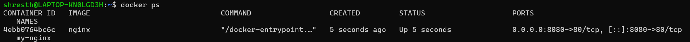
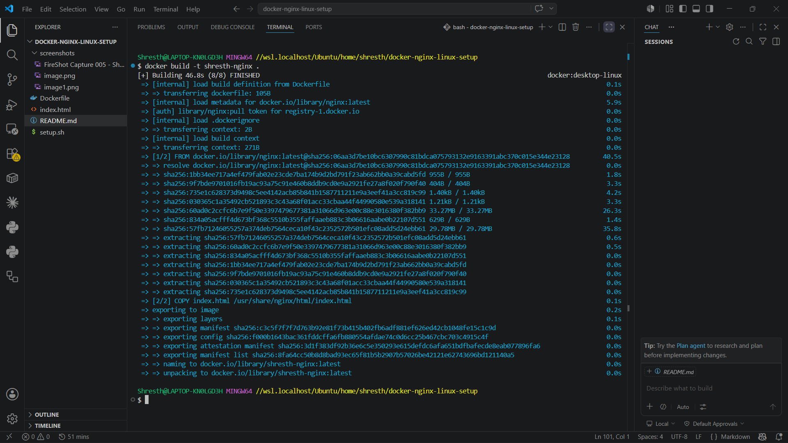
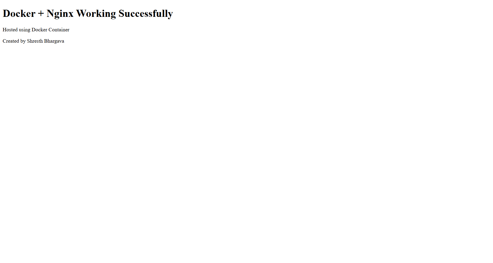
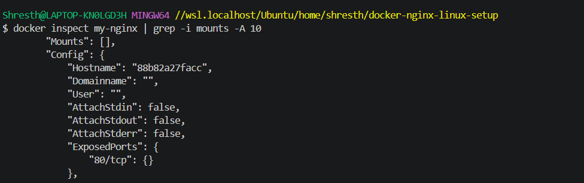
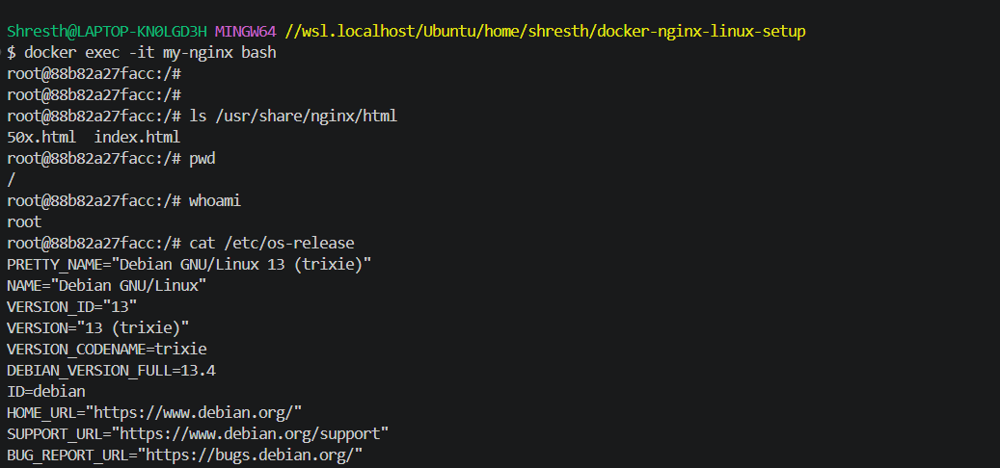

# Docker Nginx Linux Setup

## Project Overview

This project demonstrates Linux server setup and containerized web hosting using Docker and Nginx inside WSL Ubuntu.

## Features

- Docker container deployment
- Nginx web server setup
- Linux user management
- Bash automation scripting
- Volume mounting
- Custom HTML hosting
- Container lifecycle management
- Basic DevOps workflow

---

## Technologies Used

- Ubuntu (WSL)
- Docker
- Nginx
- Bash
- Git
- Linux

---

## Project Structure

```bash
docker-nginx-linux-setup/
│
├── setup.sh
├── Dockerfile
├── index.html
├── README.md
└── screenshots/
```

---

## Setup Instructions

### Clone Repository

```bash
git clone YOUR_REPO_URL
cd docker-nginx-linux-setup
```

### Run Docker Container

```bash
docker build -t shresth-nginx .
docker run -d -p 8080:80 --name my-nginx shresth-nginx
```

---

## Access Website

Open browser:

http://localhost:8080

---

## Docker Commands Used

### View Containers

```bash
docker ps
```

### Stop Container

```bash
docker stop my-nginx
```

### Remove Container

```bash
docker rm my-nginx
```

---

## Learning Outcomes

- Understanding Docker images and containers
- Linux filesystem mounting
- Nginx web hosting
- Container deployment workflow
- Docker debugging basics
- Linux user creation and permissions

---
## Screenshots

### Docker Container Running



---

### Docker Image Build



---

### Custom Nginx Website



---

### Docker Inspect Output



---

### Terminal Setup



---

## Author

Shresth Bhargava
